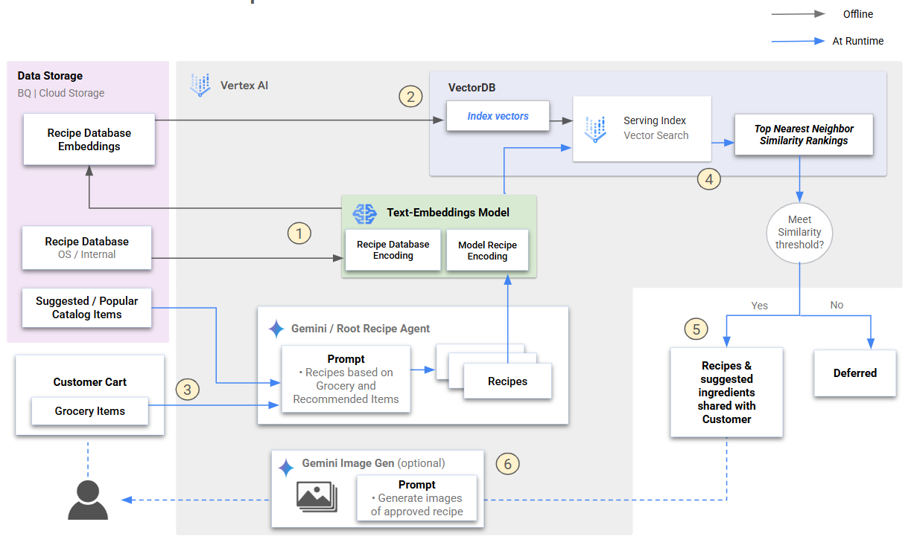

# Recipe Recommendation System with Vector Search

An intelligent recipe recommendation system that uses Google Cloud Vertex AI to generate personalized recipes based on shopping cart items and find similar recipes through vector similarity search.

## System Architecture



Offline:

1. All existing recipes databases are passed through an embeddings model  
2. The embeddings are stored and indexed in a vector database to enable similarity searches

At Runtime:

3. Model/agent creates recipes based on the user's shopping cart and suggests additional ingredients based on popular items
4. Generated recipes are converted into embeddings and compared against the indexed database 
5. If the similarity score with an existing recipe reaches a predefined threshold, the recipe is considered valid and shared with the customer. Otherwise, it is deferred
6. (optional) Generate and share images of recipe


## Repository Structure

```
recipe_workflow/
├── README.md                           # This file
├── imgs/
│   └── flow.png                       # System architecture diagram
├── 01_recipe_index.ipynb              # Recipe database indexing workflow
├── 02_cart_recipe_generation.ipynb    # Cart-based recipe generation
├── recipes_content.jsonl              # Sample recipe database
└── sample_cart.txt                    # Sample customer cart data
```

## Notebooks

### 01_recipe_index.ipynb
**Purpose**: Create and deploy a vector search index for recipe similarity matching

**Key Features**:
- Concurrent embedding generation using Gemini text-embeddings model
- Optimized vector search index creation with Tree AH algorithm
- Deployment to Vertex AI Matching Engine for real-time queries
- Performance optimization with DOT_PRODUCT_DISTANCE metrics

**Workflow**:
1. Load recipe database from JSONL format
2. Generate embeddings using batched async processing
3. Create and configure vector search index
4. Deploy index to endpoint for querying

### 02_cart_recipe_generation.ipynb
**Purpose**: Generate personalized recipes and find similar matches

**Key Features**:
- AI-powered recipe generation based on shopping cart contents
- Integration with pre-indexed recipe database
- Similarity matching using vector search
- Structured recipe output with ingredients and instructions

**Workflow**:
1. Load customer cart data
2. Generate personalized recipes using Gemini 2.5 Pro
3. Create embeddings for generated recipes
4. Query vector search index for similar existing recipes
5. Return recommendations based on similarity scores

## Sample Data

### Sample Cart (`sample_cart.txt`)
```json
{
  "cart_list": [
    "chicken breasts",
    "broccoli", 
    "carrots",
    "onion"
  ]
}
```

### Recipe Database (`recipes_content.jsonl`)
Contains 1000+ structured recipes in JSONL format with:
- Recipe titles
- Ingredient lists with quantities
- Step-by-step cooking instructions
- Additional metadata

## Key Technologies

- **Google Cloud Vertex AI**: Vector search and AI model hosting
- **Gemini Models**: 
  - `gemini-embedding-001`: Text embeddings generation
  - `gemini-2.5-pro`: Recipe generation and natural language processing
- **Python Libraries**: pandas, asyncio, google-cloud-aiplatform
- **Vector Search**: Approximate Hierarchical (Tree AH) indexing
- **Storage**: Google Cloud Storage for data and model artifacts